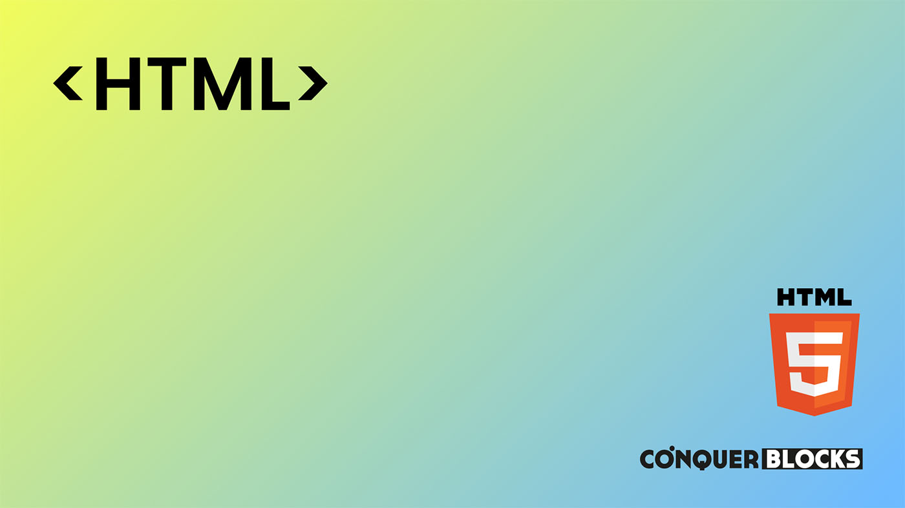

<h1>Máster en Desarrollo FullStack y Blockchain de ConquerBlocks</h1>

<h2>Repositorio creado para el módulo de HTML</h2>

<h4>Material de las clases</h4>
<ul>
    <li><a target="_blank" href="https://github.com/bienvenidosaez/conquerblocks-html/blob/5bfa363b7bc8c9fd7b5dc35f54aa814d4d254dd4/00_indice_modulo/HTML%20-%20Contenidos.pdf">Índice de contenidos del módulo</a></li>
    <li><a target="_blank" href="https://github.com/bienvenidosaez/conquerblocks-html/blob/5bfa363b7bc8c9fd7b5dc35f54aa814d4d254dd4/01_clases/Clase%2001%20-%20Introducci%C3%B3n/HTML%20Clase%2001%20-%20Introducci%C3%B3n%20-%20Diapositivas.pdf">Clase 0 - Presentación del módulo</a></li>
    <li><a target="_blank" href="./01_clases/Clase 01 - Introducción/HTML Clase 01 - Introducción - Diapositivas.pdf">Clase 1 - Introducción</a></li>
    <li><a target="_blank" href="https://github.com/bienvenidosaez/conquerblocks-html/blob/5bfa363b7bc8c9fd7b5dc35f54aa814d4d254dd4/01_clases/Clase%2002%20-%20Un%20poco%20de%20historia/HTML%20Clase%2002%20-%20Un%20poco%20de%20historia%20-%20Diapositivas.pdf">Clase 2 - Un poco de historia</a></li>
    <li><a target="_blank" href="https://github.com/bienvenidosaez/conquerblocks-html/blob/5bfa363b7bc8c9fd7b5dc35f54aa814d4d254dd4/01_clases/Clase%2003%20-%20Los%20lenguajes%20de%20marcas/HTML%20Clase%2003%20-%20Los%20lenguajes%20de%20marcas%20-%20Diapositivas.pdf">Clase 3 - Los lenguajes de marcas</a></li>
    <li><a target="_blank" href="https://github.com/bienvenidosaez/conquerblocks-html/blob/main/01_clases/Clase%2004%20-%20Estructura%20de%20una%20p%C3%A1gina%20web/HTML%20-%20Clase%2004%20-%20Estructura%20de%20una%20p%C3%A1gina%20web%20-%20Diapositivas.pdf">Clase 4 - Estructura de una página web</a></li>
    <li><a target="_blank" href="https://github.com/bienvenidosaez/conquerblocks-html/blob/main/01_clases/Clase%2005%20-%20Texto%20en%20HTML/HTML%20-%20Clase%2005%20-%20Texto%20en%20HTML%20-%20Diapositivas.pdf">Clase 5 - Texto en HTML</a></li>
    <li><a target="_blank" href="https://github.com/bienvenidosaez/conquerblocks-html/blob/main/01_clases/Clase%2006%20-%20Etiquetas%20sem%C3%A1nticas%20y%20su%20importancia/HTML%20-%20Clase%2006%20-%20Diapositivas.pdf">Clase 6 - Etiquetas semánticas</a></li>
    <li><a target="_blank" href="https://github.com/bienvenidosaez/conquerblocks-html/blob/main/01_clases/Clase%2006%20-%20Etiquetas%20sem%C3%A1nticas%20y%20su%20importancia/HTML%20-%20Clase%2006%20-%20Tareas.pdf">Clase 6.1 - Tareas Etiquetas semánticas</a></li>
    <li><a target="_blank" href="https://github.com/bienvenidosaez/conquerblocks-html/blob/main/01_clases/Clase%2007%20-%20Etiquetas%20de%20agrupaci%C3%B3n/HTML%20-%20Clase%2007%20-%20Etiquetas%20de%20agrupaci%C3%B3n%20-%20Diapositivas.pdf">Clase 7 - Etiquetas de agrupación</a></li>
    <li><a target="_blank" href="https://github.com/bienvenidosaez/conquerblocks-html/blob/main/01_clases/Clase%2007%20-%20Etiquetas%20de%20agrupaci%C3%B3n/HTML%20-%20Clase%2007%20-%20Etiquetas%20de%20agrupaci%C3%B3n%20-%20Tareas.pdf">Clase 7.1 - Tareas sobre etiquetas de agrupación</a></li>
    <li><a target="_blank" href="https://github.com/bienvenidosaez/conquerblocks-html/blob/main/01_clases/Clase%2008%20-%20Tablas/HTML%20Clase%2008%20-%20Tablas%201%20(Diapositivas).pdf">Clase 8 - Tablas</a></li>
    <li><a target="_blank" href="https://github.com/bienvenidosaez/conquerblocks-html/blob/main/01_clases/Clase%2008%20-%20Tablas/HTML%20Clase%2008%20-%20Tablas%201%20(Tareas).pdf">Clase 8.1 - Tareas sobre Tablas</a></li>
    <li><a target="_blank" href="https://github.com/bienvenidosaez/conquerblocks-html/blob/main/01_clases/Clase%2009%20-%20Tablas%20avanzadas/HTML%20Clase%2009%20-%20Tablas%20Avanzadas.pdf">Clase 9 - Tablas avanzadas</a></li>
    <li><a target="_blank" href="https://github.com/bienvenidosaez/conquerblocks-html/blob/main/01_clases/Clase%2010%20-%20Formularios%20I/HTML%20Clase%2010%20-%20Formularios%20I%20(Diapositivas).pdf">Clase 10 - Formularios I</a></li>
    <li><a target="_blank" href="https://github.com/bienvenidosaez/conquerblocks-html/blob/main/01_clases/Clase%2011%20-%20Formularios%20II/HTML%20Clase%2011%20-%20Formularios%20II%20(Diapositivas).pdf">Clase 11 - Formularios II</a></li>
    <li><a target="_blank" href="https://github.com/bienvenidosaez/conquerblocks-html/blob/main/01_clases/Clase%2012%20-%20Tareas%20con%20formularios/HTML%20Clase%2012%20-%20Tareas%20sobre%20formularios%20(Dispositivas).pdf">Clase 12 - Resolución de tareas con formularios básicos y avanzados</a></li>
    <li><a target="_blank" href="https://github.com/bienvenidosaez/conquerblocks-html/blob/main/01_clases/Clase%2013%20-%20Imagenes%20en%20la%20web/HTML%20Clase%2013%20-%20Im%C3%A1genes%20en%20la%20web.pdf">Clase 13 - Imágenes en la web</a></li>
    <li><a target="_blank" href="https://github.com/bienvenidosaez/conquerblocks-html/blob/main/01_clases/Clase%2014%20-%20Etiquetas%20multimedia/HTML%20Clase%2014%20-%20Etiquetas%20multimedia%20(Diapositivas).pdf">Clase 14 - Etiquetas multimedia</a></li>
    <li><a target="_blank" href="https://github.com/bienvenidosaez/conquerblocks-html/blob/main/01_clases/Clase%2015%20-%20Etiquetas%20interactivas/HTML%20Clase%2015%20-%20Etiquetas%20interactivas.pdf">Clase 15 - Etiquetas interactivas</a></li>
</ul>

<h4>Clases Bonus</h4>
<ul>
    <li>Clase Bonus - Repositorio en Github para el seguimiento de las clases</li>
    <li><a target="_blank" href="https://github.com/bienvenidosaez/conquerblocks-html/blob/main/01_clases/Clase%20Bonus%20-%20Instalaci%C3%B3n%20y%20creaci%C3%B3n%20de%20un%20Favicon/Clase%20Bonus%20-%20Creaci%C3%B3n%20e%20instalaci%C3%B3n%20de%20un%20Favicon%20(Diapositivas).pdf">Clase Bonus - Instalación y creación de un Favicon</a></li>
    <li><a target="_blank" href="https://github.com/bienvenidosaez/conquerblocks-html/blob/main/01_clases/Clase%20Bonus%20-%20LiveServer%20y%20SimpleHTTPServer/Clase%20Bonus%20-%20LiveServer%20y%20SimpleHTTPServer%20-%20Diapositivas.pdf">Clase Bonus - LiveServer y SimpleHTTPServer</a></li>
    <li><a target="_blank" href="https://github.com/bienvenidosaez/conquerblocks-html/blob/main/01_clases/Clase%20Bonus%20-%20Windows%20Resizer%20y%20mas/Clase%20Bonus%20-%20Windows%20Resizer.pdf">Clase Bonus - Windows Resizer y contenido dummy</a></li>
</ul>
